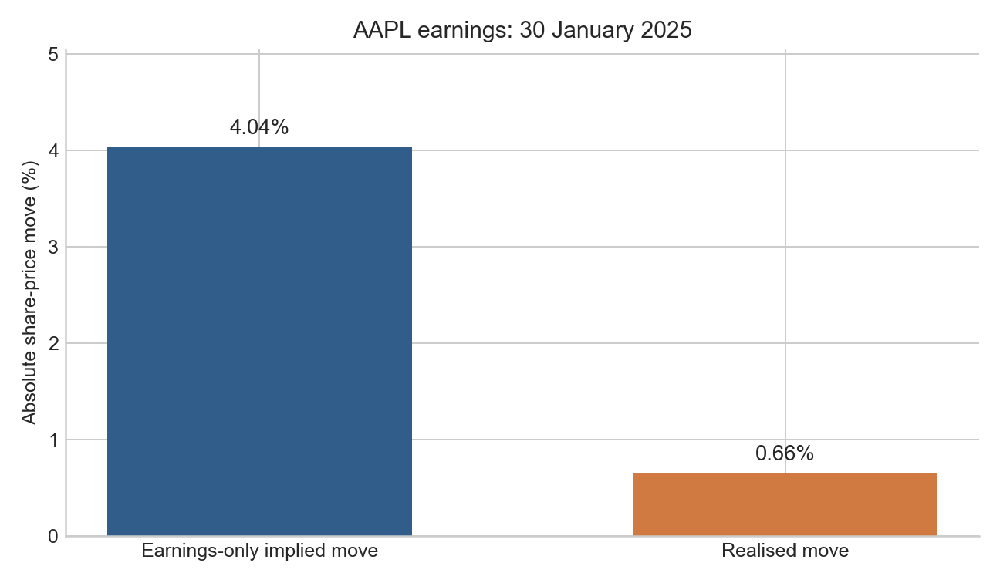

# pyQuant

[](https://github.com/aryanbagade13/PyQuant/actions/workflows/tests.yml)

pyQuant is my Python research project for studying how options price earnings
announcements. It reconstructs the move implied before an event, measures the
subsequent share-price move, and keeps enough source data to audit the result.

The project began as an options-pricing library and now focuses on one question:
how much of the term structure of implied variance can reasonably be attributed
to an upcoming earnings announcement?

## Verified case study

I reconstructed Apple's 30 January 2025 after-market-close announcement using
historical Alpaca option and stock bars:

| Observation | Result |
|---|---:|
| Option observation | 15 January 2025, 3:55 p.m. New York |
| Contemporaneous spot | $237.82 |
| Short / long ATM IV | 19.93% / 27.74% |
| Earnings-only implied move | 4.04% |
| Realised close-to-close move | 0.66% |
| Realised / implied | 0.16x |



This single observation does not establish a trading edge. The option inputs
are indicative minute-bar closes rather than executable bid/ask midpoints. The
[saved result](examples/results/aapl_2025-01-30.csv) records the inputs,
assumptions, output, and data source used in the comparison.

## Method

For each reviewed earnings event, pyQuant:

1. resolves whether the announcement occurred before the open or after the
   close;
2. selects expiries immediately before and after the event;
3. observes both expiries at the same fixed pre-event cutoff;
4. converts ATM call and put prices to implied volatility; and
5. subtracts estimated ordinary variance from the variance between expiries.

The estimate is

```text
total variance = implied volatility^2 * time to expiry
earnings variance = long variance - short variance
                    - ordinary variance between expiries
earnings implied move = sqrt(max(earnings variance, 0))
```

The short-expiry ATM volatility is currently used as the ordinary-volatility
estimate. Both the raw estimate and any zero floor are retained for diagnosis.
See [the architecture note](docs/architecture.md) for the data flow and the
assumptions behind the calculation.

## What is implemented

- Black-Scholes pricing, implied volatility, and analytical Greeks
- Portfolio valuation and aggregated risk reporting
- Volatility-smile and volatility-surface construction
- Historical earnings and release-timing retrieval
- Trading-session-aware pre/post-event price windows
- Historical ATM-straddle and two-expiry variance reconstruction
- Deterministic CSV output and offline automated tests
- An experimental Streamlit option-chain dashboard

## Installation

Python 3.10 or newer is required.

```bash
python -m venv venv
source venv/bin/activate
python -m pip install -e ".[dev]"
```

Copy `.env.example` to `.env` and add your own credentials. Local credentials,
provider caches, and generated research datasets are excluded from Git.

## Run the research workflows

Build one historical earnings observation:

```bash
pyquant-earnings AAPL \
  --event-date 2025-01-30 \
  --release-timing after_market_close
```

The override is required when the calendar source does not supply a usable
announcement time. To retrieve earnings and stock data without historical
options:

```bash
pyquant-earnings AAPL --max-events 1 --without-implied-move
```

Run the two-expiry case study:

```bash
python examples/historical_earnings_variance.py
```

This command makes live provider requests and may consume API quota. The saved
CSV and chart can be reproduced without credentials:

```bash
python examples/plot_earnings_comparison.py
```

Run the offline checks with:

```bash
python -m pytest -q
ruff check .
ruff format --check .
```

## Research limitations

- Historical Alpaca options are only available from February 2024.
- Basic-plan option bars may differ from OPRA quotes and executable prices.
- US equity options are American-style, while the current IV inversion uses a
  European Black-Scholes model.
- Averaging call and put IV is a transparent approximation, not a fitted
  volatility surface.
- Interest rates and dividend yields are supplied explicitly rather than
  reconstructed as point-in-time curves.
- Unknown or during-market-hours release timings are excluded.
- The current evidence is a case study, not a backtest or profitable strategy.

The immediate next step is to repeat the same fixed methodology across a wider
set of reviewed events before attempting predictive modelling. The shorter
[research roadmap](pyquant/event_volatility/earnings_lab/EARNINGS_LAB_ROADMAP.md)
records what is complete and what still needs evidence.
